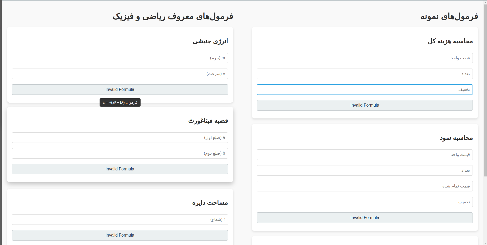
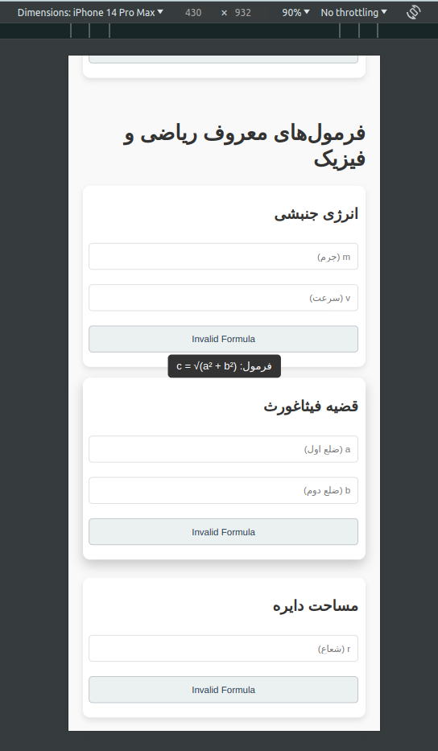

# گزارش تمرین اول درس برنامه‌نویسی وب

فایل‌های موجود در این مخزن به شکل زیر هستند:
```bash
.
├── index.html
├── README.md
├── script.js
└── styles.css

0 directories, 4 files
```

فایل `index.html` شامل ۶ فرمول می‌باشد که سه‌تای آن‌ها، مانند مثال موجود در صورت تمرین و سه‌تای دیگر فرمول‌های پرکاربرد و معروف ریاضی و فیزیک هستند.

هر فرمول در فایل `HTML` به‌شکل زیر تعریف شده است:
```html
<div class="formula-container">
    <h2>نام فرمول</h2>
    <input type="text" id="x" placeholder="">
    <input type="text" id="y" placeholder="">
    <input type="text" id="z" placeholder="">
    <formula evaluator="x*y/z*Math.PI...."></formula>
    <output id="result_i" readonly></output>
    <span class="formula-tooltip">فرمول: مقدار خروجی = x * y / z * π ...</span>
</div>
```
برای validate کردن ورودی‌ها بدون نیاز به افزودن منطق جدید به اسکریپت `Js`، بعضی مقادیر در صفت `evaluator` بدین شکل نوشته شده‌اند:

```js
Math.sqrt(sideA)*Math.sqrt(sideA)
```
بدین شکل، صرفا مقادیر نامنفی را برای `sideA` قبول می‌کنیم.

تگ `formula` نیز در اسکریپت `Js`  استفاده می‌شود و مقداری که در ویژگی (attribute) `evaluator` قرار دارد توسط تابع `()eval` ارزیابی شده و خروجی درصورت valid بودن در `output` نمایش می‌گیرد.

```js
try {
    const result = eval(expression);
    return isNaN(result) ? "Invalid Formula" : result;
} catch (e) {
    return "Invalid Formula";
}
```

همچنین با این تکه کد، روی همه input filedها، یک `listener` تنظیم شده تا در صورت بروز هر تغییری در مقادیر، خروجی به‌صورت real-time محاسبه شود.
```js
const inputFields = document.querySelectorAll("input");
inputFields.forEach(input => {
    input.addEventListener("input", updateResults);
});
```

این تابع نیز تغییرات را درون output fieldها اعمال می‌کند.
```js
function updateResults() {
    const formulaElements = document.querySelectorAll("formula");
    formulaElements.forEach((formulaElement, index) => {
        const resultElement = document.getElementById(`result${index + 1}`);
        if (resultElement) {
            resultElement.value = evaluateFormula(formulaElement);
        }
    });
}
```

همچنین صفحه‌ای که در مرورگر بارگزاری می‌شود به چندین بخش تقسیم شده تا طراحی Responsive راحت‌تر اعمال شود. برای مثال تگ‌های `div` با این صفت‌ها در صفحه حضور دارند:
```html
<div class="formula-grid"></div>
<div class="formula-column"></div>
<div class="formula-container"></div>
```

هرکلاس در فایل `styles.css` استایل مربوط به خود را دارد. برای مثال:
```css
.formula-container {
    background-color: #ffffff;
    padding: 20px;
    margin-bottom: 20px;
    border-radius: 10px;
    box-shadow: 0 4px 8px rgba(0, 0, 0, 0.1);
    transition: transform 0.3s ease, box-shadow 0.3s ease;
    position: relative;
}
```

همچنین از `media rule@` نیز برای استفاده شده تا صفحه طراحی‌شده روی دسکتاپ و موبایل به‌درستی نمایش داده‌شود.

دسکتاپ:


موبایل:


**توجه**: ایده استفاده و پیاده‌سازی از `media@` از deepseek.com بود.